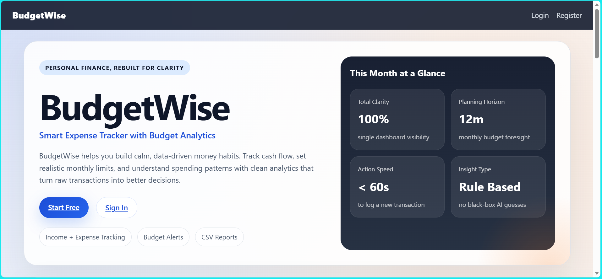
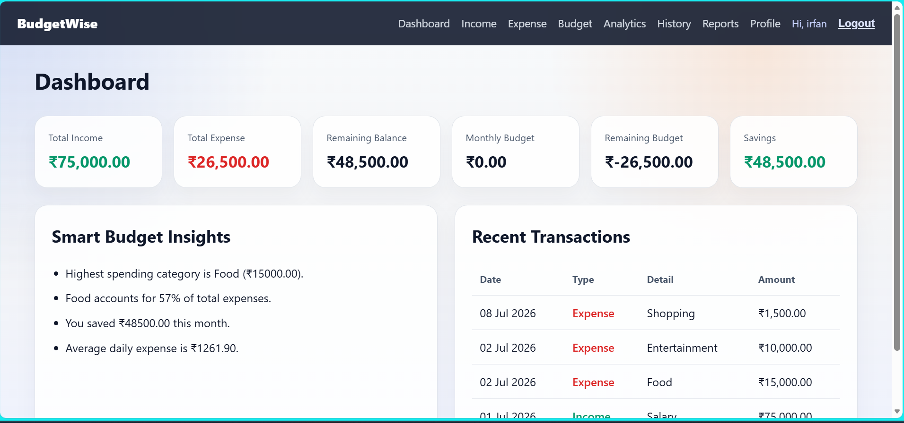
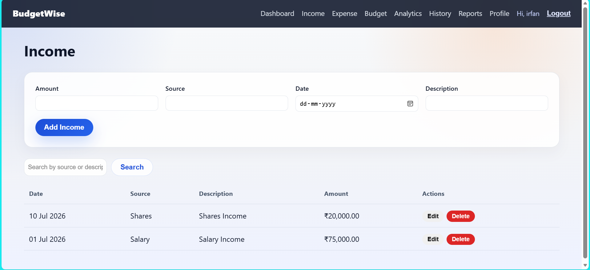
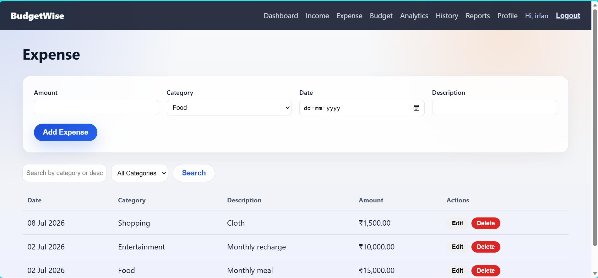
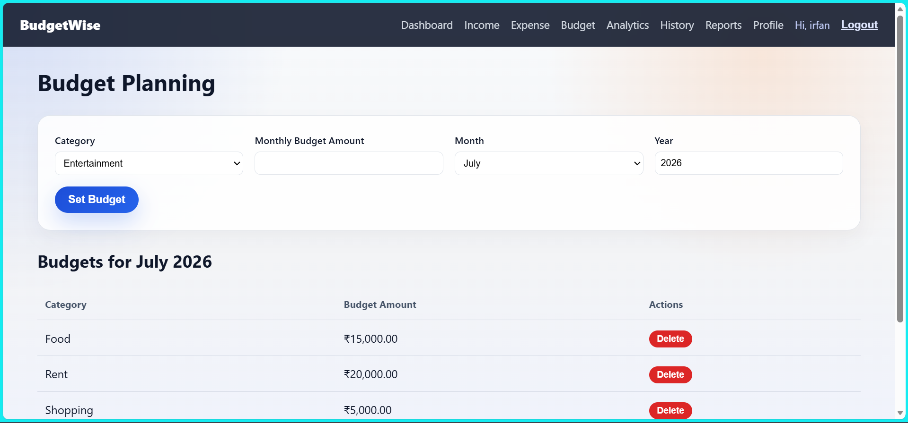
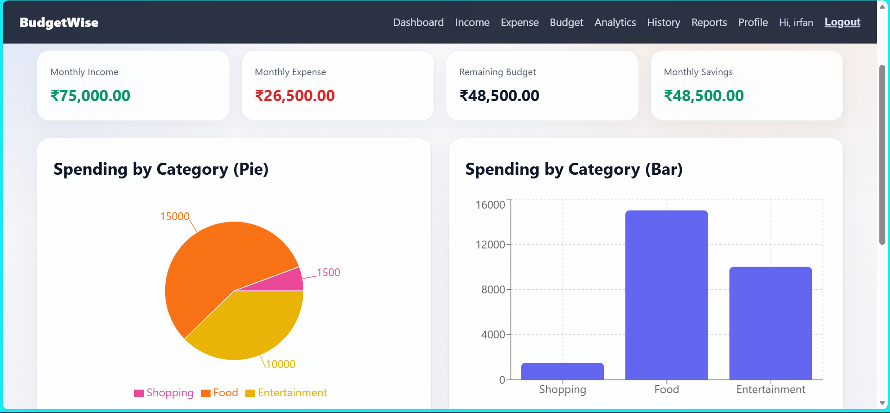
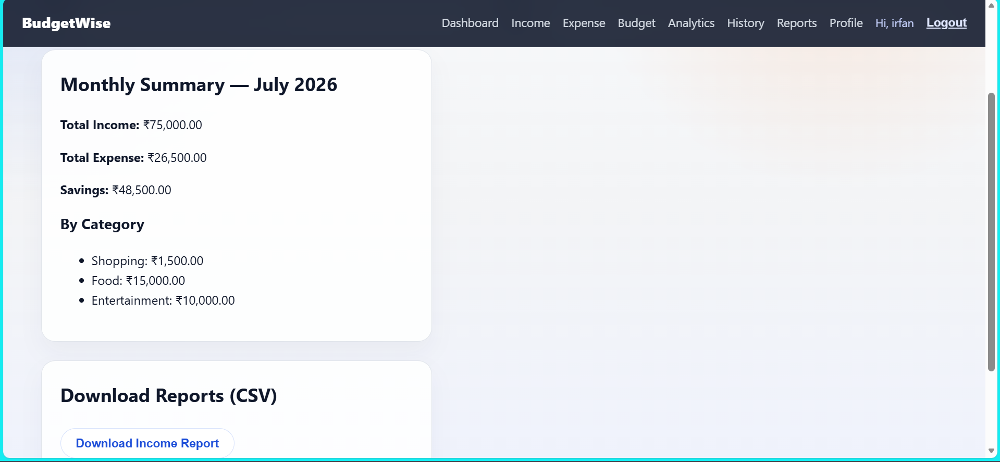

# BudgetWise

A full-stack personal finance tracker built to answer a simple question I kept asking myself: *where did my money actually go this month?* BudgetWise lets users log income and expenses, set category-level budgets, and see spending patterns through charts instead of a spreadsheet nobody updates.

**Stack:** React (Vite) · Node.js/Express · TiDB Cloud (MySQL-compatible) · JWT · deployed on Vercel + Render

- Live app: https://budgetwise-ebon.vercel.app/
- API: https://budgetwise-api-vehr.onrender.com/api

---

## Why this project

Most budgeting apps are either too simple (a static category list) or too bloated (bank sync, investment tracking, subscriptions you don't need). BudgetWise sits in between — manual entry, but fast enough that you'll actually keep it up, with just enough analysis to catch overspending before the month ends rather than after.

## Screenshots

| Home | Dashboard |
|---|---|
|  |  |

| Income | Expense |
|---|---|
|  |  |

| Budget Planner | Analytics |
|---|---|
|  |  |

| Reports |
|---|
|  |

---

## What it does

**Auth** — Registration/login backed by JWT, passwords hashed with bcrypt, protected routes on both client and API sides.

**Dashboard** — A single view of total income, total expenses, current balance, monthly budget status, savings, and the most recent transactions — the stuff you'd otherwise have to piece together manually.

**Income & Expenses** — Full CRUD on both, with search and date filtering. Expenses are further split into categories (Food, Rent, Shopping, Travel, Education, Health, Entertainment, Bills, Others) so the analytics actually mean something.

**Budgeting** — Set an overall monthly budget or go category-by-category. The app tracks utilization against each and flags when you're close to or over a limit.

**Analytics** — Category breakdown as a pie chart, a daily spending trend line, and month-over-month comparisons of income vs. expenses.

**Insights (rule-based, not ML)** — A few straightforward heuristics run against the data: which category you overspent in, whether this month is trending worse than last, your daily average burn rate, and a savings summary. No model here — just clear rules that produce useful answers quickly.

**Reports** — Monthly summaries, transaction history with search/filter, and CSV export for income and expenses separately.

**Profile** — Update your name, change your password.

---

## Architecture

```
React (Vite) client
      │  Axios
      ▼
Express REST API  ──►  JWT middleware validates every protected request
      │
      ▼
TiDB Cloud (MySQL-compatible, serverless)
```

Frontend and backend are deployed separately (Vercel / Render) and talk over HTTPS — no server-side rendering, no monorepo build step to worry about.

## Tech stack

| Layer | Choice | Why |
|---|---|---|
| Frontend | React + Vite | Fast dev server, no CRA overhead |
| Routing | React Router | Standard SPA routing |
| HTTP | Axios | Interceptors for attaching JWT + handling 401s |
| Charts | Recharts | Composable, plays nicely with React state |
| Backend | Node.js + Express | Minimal, well-understood REST layer |
| Auth | JWT + bcrypt | Stateless auth, no session store needed |
| Database | TiDB Cloud | MySQL-compatible but serverless — no server to provision or babysit |

---

## Project structure

```
budgetwise/
├── client/
│   ├── src/
│   │   ├── components/
│   │   ├── context/       # auth + global state
│   │   ├── pages/
│   │   ├── services/      # axios instances, API calls
│   │   └── utils/
│   └── public/
│
├── server/
│   ├── config/
│   ├── controllers/
│   ├── database/
│   │   └── schema.sql
│   ├── middleware/        # JWT auth guard
│   ├── models/
│   └── routes/
│
└── README.md
```

---

## Running it locally

```bash
git clone https://github.com/irfan-aman/budgetwise.git
cd budgetwise
```

**Server**

```bash
cd server
npm install
cp .env.example .env   # fill in the values below
npm run dev
```

```env
PORT=5000
DB_HOST=your_host
DB_PORT=4000
DB_USER=your_username
DB_PASSWORD=your_password
DB_NAME=budgetwise
DB_SSL=true
JWT_SECRET=your_secret
JWT_EXPIRES_IN=7d
CLIENT_URL=http://localhost:5173
```

**Client**

```bash
cd client
npm install
cp .env.example .env   # set VITE_API_URL=http://localhost:5000/api
npm run dev
```

---

## API reference

| Resource | Endpoints |
|---|---|
| Auth | `POST /api/auth/register`, `POST /api/auth/login` |
| Income | `GET/POST /api/income`, `PUT/DELETE /api/income/:id` |
| Expenses | `GET/POST /api/expense`, `PUT/DELETE /api/expense/:id` |
| Budget | `GET/POST /api/budget`, `PUT/DELETE /api/budget/:id` |
| Dashboard | `GET /api/dashboard`, `GET /api/dashboard/analytics` |
| Profile | `GET/PUT /api/profile` |
| Reports | `GET /api/reports/summary`, `GET /api/reports/income/csv`, `GET /api/reports/expense/csv` |

---

## Deployment

- **Database** — TiDB Cloud (serverless tier)
- **API** — Render
- **Frontend** — Vercel

## What I took away from building this

This was my first project combining a serverless MySQL-compatible database with a traditional Express API — mostly straightforward, but connection pooling and SSL config needed more attention than a local MySQL instance would have. Beyond that: designing a normalized schema for income/expense/budget relationships, writing JWT middleware that doesn't leak on edge cases, and structuring an Express API that stays readable as routes multiply.

## Roadmap

- [ ] Dark mode
- [ ] Email notifications for budget alerts
- [ ] OCR-based bill scanning
- [ ] Recurring transactions
- [ ] PWA support / mobile app

---

## License

MIT
